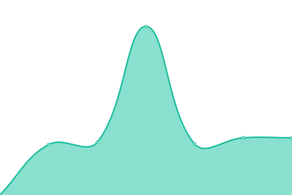

# [📈 Live Status](https://SergioRugiero.github.io/UptimeDropit): <!--live status--> **🟧 Partial outage**

This repository contains the open-source uptime monitor and status page for [SergioRugiero](https://SergioRugiero.github.io/UptimeDropit), powered by [Upptime](https://github.com/upptime/upptime).

With [Upptime](https://upptime.js.org), you can get your own unlimited and free uptime monitor and status page, powered entirely by a GitHub repository. We use [Issues](https://github.com/SergioRugiero/UptimeDropit/issues) as incident reports, [Actions](https://github.com/SergioRugiero/UptimeDropit/actions) as uptime monitors, and [Pages](https://SergioRugiero.github.io/UptimeDropit) for the status page.

<!--start: status pages-->
<!-- This summary is generated by Upptime (https://github.com/upptime/upptime) -->
<!-- Do not edit this manually, your changes will be overwritten -->
<!-- prettier-ignore -->
| URL | Status | History | Response Time | Uptime |
| --- | ------ | ------- | ------------- | ------ |
| [Pickit Argentina](https://www.pickit.com.ar) | 🟩 Up | [pickit-argentina.yml](https://github.com/SergioRugiero/UptimeDropit/commits/master/history/pickit-argentina.yml) | 

 2994ms
     
 | 

   

| [Pickit Colombia](https://www.pickit.com.co) | 🟩 Up | [pickit-colombia.yml](https://github.com/SergioRugiero/UptimeDropit/commits/master/history/pickit-colombia.yml) | 

 1863ms
     
 | 

   

| [Pickit Mexico](https://www.pickit.com.mx) | 🟩 Up | [pickit-mexico.yml](https://github.com/SergioRugiero/UptimeDropit/commits/master/history/pickit-mexico.yml) | 

 1856ms
     
 | 

   

| [Pickit Uruguay](https://www.pickit.com.uy) | 🟩 Up | [pickit-uruguay.yml](https://github.com/SergioRugiero/UptimeDropit/commits/master/history/pickit-uruguay.yml) | 

 1869ms
     
 | 

   

| [Pickit Jira](http://support.pickit.net) | 🟩 Up | [pickit-jira.yml](https://github.com/SergioRugiero/UptimeDropit/commits/master/history/pickit-jira.yml) | 

 1399ms
     
 | 

   

| [Pickit Odoo](https://odoo.pickit.net/web/login) | 🟩 Up | [pickit-odoo.yml](https://github.com/SergioRugiero/UptimeDropit/commits/master/history/pickit-odoo.yml) | 

 1809ms
     
 | 

   

| Secret Site | 🟥 Down | [secret-site.yml](https://github.com/SergioRugiero/UptimeDropit/commits/master/history/secret-site.yml) | 

 994ms
     
 | 

   

<!--end: status pages-->

[**Visit our status website →**](https://SergioRugiero.github.io/UptimeDropit)

## 📄 License

- Code: [MIT](./LICENSE) © [SergioRugiero](https://SergioRugiero.github.io/UptimeDropit)
- Data in the `./history` directory: [Open Database License](https://opendatacommons.org/licenses/odbl/1-0/)
