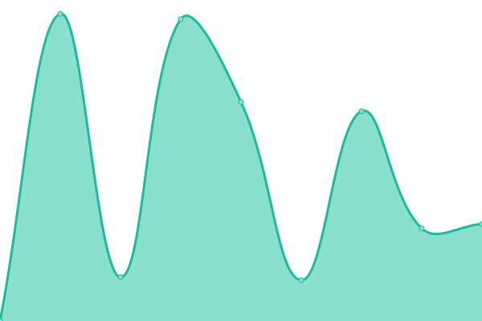
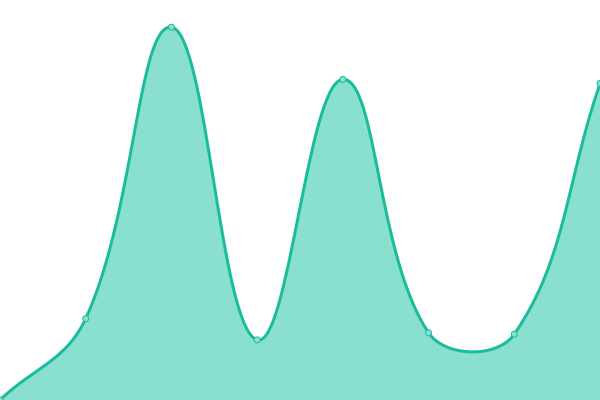
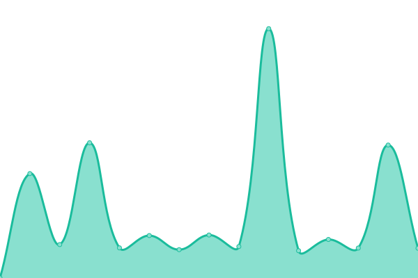

# [📈 Live Status](https://SergioRugiero.github.io/UptimeDropit): <!--live status--> **🟧 Partial outage**

This repository contains the open-source uptime monitor and status page for [SergioRugiero](https://SergioRugiero.github.io/UptimeDropit), powered by [Upptime](https://github.com/upptime/upptime).

With [Upptime](https://upptime.js.org), you can get your own unlimited and free uptime monitor and status page, powered entirely by a GitHub repository. We use [Issues](https://github.com/SergioRugiero/UptimeDropit/issues) as incident reports, [Actions](https://github.com/SergioRugiero/UptimeDropit/actions) as uptime monitors, and [Pages](https://SergioRugiero.github.io/UptimeDropit) for the status page.

<!--start: status pages-->
<!-- This summary is generated by Upptime (https://github.com/upptime/upptime) -->
<!-- Do not edit this manually, your changes will be overwritten -->
<!-- prettier-ignore -->
| URL | Status | History | Response Time | Uptime |
| --- | ------ | ------- | ------------- | ------ |
|  [Pickit Argentina](https://www.pickit.com.ar) | 🟩 Up | [pickit-argentina.yml](https://github.com/SergioRugiero/UptimeDropit/commits/HEAD/history/pickit-argentina.yml) | 

 845ms
     
 | 

<a href="https://SergioRugiero.github.io/UptimeDropit/history/pickit-argentina">100.00%</a>
    

|  [Pickit Argentina Admin](https://admin.pickit.net/) | 🟩 Up | [pickit-argentina-admin.yml](https://github.com/SergioRugiero/UptimeDropit/commits/HEAD/history/pickit-argentina-admin.yml) | 

 530ms
     
 | 

<a href="https://SergioRugiero.github.io/UptimeDropit/history/pickit-argentina-admin">100.00%</a>
    

|  [Pickit Argentina Comercio](https://comercio.pickit.net/) | 🟩 Up | [pickit-argentina-comercio.yml](https://github.com/SergioRugiero/UptimeDropit/commits/HEAD/history/pickit-argentina-comercio.yml) | 

 545ms
     
 | 

<a href="https://SergioRugiero.github.io/UptimeDropit/history/pickit-argentina-comercio">100.00%</a>
    

|  [Pickit Argentina Punto](https://punto.pickit.net/) | 🟩 Up | [pickit-argentina-punto.yml](https://github.com/SergioRugiero/UptimeDropit/commits/HEAD/history/pickit-argentina-punto.yml) | 

 540ms
     
 | 

<a href="https://SergioRugiero.github.io/UptimeDropit/history/pickit-argentina-punto">100.00%</a>
    

|  [Pickit Colombia](https://www.pickit.com.co) | 🟩 Up | [pickit-colombia.yml](https://github.com/SergioRugiero/UptimeDropit/commits/HEAD/history/pickit-colombia.yml) | 

 808ms
     
 | 

<a href="https://SergioRugiero.github.io/UptimeDropit/history/pickit-colombia">100.00%</a>
    

|  [Pickit Colombia Admin](https://admin.pickit.com.co/) | 🟩 Up | [pickit-colombia-admin.yml](https://github.com/SergioRugiero/UptimeDropit/commits/HEAD/history/pickit-colombia-admin.yml) | 

 558ms
     
 | 

<a href="https://SergioRugiero.github.io/UptimeDropit/history/pickit-colombia-admin">100.00%</a>
    

|  [Pickit Colombia Comercio](https://comercio.pickit.com.co/) | 🟩 Up | [pickit-colombia-comercio.yml](https://github.com/SergioRugiero/UptimeDropit/commits/HEAD/history/pickit-colombia-comercio.yml) | 

 532ms
     
 | 

<a href="https://SergioRugiero.github.io/UptimeDropit/history/pickit-colombia-comercio">100.00%</a>
    

|  [Pickit Colombia Punto](https://punto.pickit.com.co/) | 🟩 Up | [pickit-colombia-punto.yml](https://github.com/SergioRugiero/UptimeDropit/commits/HEAD/history/pickit-colombia-punto.yml) | 

 512ms
     
 | 

<a href="https://SergioRugiero.github.io/UptimeDropit/history/pickit-colombia-punto">100.00%</a>
    

|  [Pickit Mexico](https://www.pickit.com.mx) | 🟩 Up | [pickit-mexico.yml](https://github.com/SergioRugiero/UptimeDropit/commits/HEAD/history/pickit-mexico.yml) | 

 830ms
     
 | 

<a href="https://SergioRugiero.github.io/UptimeDropit/history/pickit-mexico">100.00%</a>
    

|  [Pickit Mexico Admin](https://admin.pickit.com.mx/) | 🟩 Up | [pickit-mexico-admin.yml](https://github.com/SergioRugiero/UptimeDropit/commits/HEAD/history/pickit-mexico-admin.yml) | 

 542ms
     
 | 

<a href="https://SergioRugiero.github.io/UptimeDropit/history/pickit-mexico-admin">100.00%</a>
    

|  [Pickit Mexico Comercio](https://comercio.pickit.com.mx/) | 🟩 Up | [pickit-mexico-comercio.yml](https://github.com/SergioRugiero/UptimeDropit/commits/HEAD/history/pickit-mexico-comercio.yml) | 

 643ms
     
 | 

<a href="https://SergioRugiero.github.io/UptimeDropit/history/pickit-mexico-comercio">100.00%</a>
    

|  [Pickit Mexico Punto](https://punto.pickit.com.mx/) | 🟩 Up | [pickit-mexico-punto.yml](https://github.com/SergioRugiero/UptimeDropit/commits/HEAD/history/pickit-mexico-punto.yml) | 

 583ms
     
 | 

<a href="https://SergioRugiero.github.io/UptimeDropit/history/pickit-mexico-punto">100.00%</a>
    

|  [Pickit Uruguay](https://www.pickit.com.uy) | 🟩 Up | [pickit-uruguay.yml](https://github.com/SergioRugiero/UptimeDropit/commits/HEAD/history/pickit-uruguay.yml) | 

 926ms
     
 | 

<a href="https://SergioRugiero.github.io/UptimeDropit/history/pickit-uruguay">100.00%</a>
    

|  [Pickit Uruguay Admin](https://admin.pickit.com.uy/) | 🟩 Up | [pickit-uruguay-admin.yml](https://github.com/SergioRugiero/UptimeDropit/commits/HEAD/history/pickit-uruguay-admin.yml) | 

 897ms
     
 | 

<a href="https://SergioRugiero.github.io/UptimeDropit/history/pickit-uruguay-admin">100.00%</a>
    

|  [Pickit Uruguay Comercio](https://comercio.pickit.com.uy/) | 🟩 Up | [pickit-uruguay-comercio.yml](https://github.com/SergioRugiero/UptimeDropit/commits/HEAD/history/pickit-uruguay-comercio.yml) | 

 630ms
     
 | 

<a href="https://SergioRugiero.github.io/UptimeDropit/history/pickit-uruguay-comercio">100.00%</a>
    

|  [Pickit Uruguay Punto](https://punto.pickit.com.uy/) | 🟩 Up | [pickit-uruguay-punto.yml](https://github.com/SergioRugiero/UptimeDropit/commits/HEAD/history/pickit-uruguay-punto.yml) | 

 744ms
     
 | 

<a href="https://SergioRugiero.github.io/UptimeDropit/history/pickit-uruguay-punto">100.00%</a>
    

|  [Pickit Jira](http://support.pickit.net) | 🟥 Down | [pickit-jira.yml](https://github.com/SergioRugiero/UptimeDropit/commits/HEAD/history/pickit-jira.yml) | 

 0ms
     
 | 

<a href="https://SergioRugiero.github.io/UptimeDropit/history/pickit-jira">0.00%</a>
    

|  [Pickit Odoo](https://odoo.pickit.net/web/login) | 🟩 Up | [pickit-odoo.yml](https://github.com/SergioRugiero/UptimeDropit/commits/HEAD/history/pickit-odoo.yml) | 

 707ms
     
 | 

<a href="https://SergioRugiero.github.io/UptimeDropit/history/pickit-odoo">99.75%</a>
    

|  [Pickit México Admin](https://admin.pickit.com.mx/) | 🟩 Up | [pickit-mexico-admin.yml](https://github.com/SergioRugiero/UptimeDropit/commits/HEAD/history/pickit-mexico-admin.yml) | 

 542ms
     
 | 

<a href="https://SergioRugiero.github.io/UptimeDropit/history/pickit-mexico-admin">100.00%</a>
    

|  Secret Site | 🟩 Up | [secret-site.yml](https://github.com/SergioRugiero/UptimeDropit/commits/HEAD/history/secret-site.yml) | 

 1005ms
     
 | 

<a href="https://SergioRugiero.github.io/UptimeDropit/history/secret-site">100.00%</a>
    

<!--end: status pages-->

[**Visit our status website →**](https://SergioRugiero.github.io/UptimeDropit)

## 📄 License

- Code: [MIT](./LICENSE) © [SergioRugiero](https://SergioRugiero.github.io/UptimeDropit)
- Data in the `./history` directory: [Open Database License](https://opendatacommons.org/licenses/odbl/1-0/)
