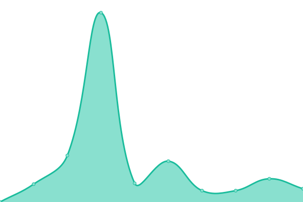

# [📈 Live Status](https://SergioRugiero.github.io/UptimeDropit): <!--live status--> **🟧 Partial outage**

This repository contains the open-source uptime monitor and status page for [SergioRugiero](https://SergioRugiero.github.io/UptimeDropit), powered by [Upptime](https://github.com/upptime/upptime).

With [Upptime](https://upptime.js.org), you can get your own unlimited and free uptime monitor and status page, powered entirely by a GitHub repository. We use [Issues](https://github.com/SergioRugiero/UptimeDropit/issues) as incident reports, [Actions](https://github.com/SergioRugiero/UptimeDropit/actions) as uptime monitors, and [Pages](https://SergioRugiero.github.io/UptimeDropit) for the status page.

<!--start: status pages-->
<!-- This summary is generated by Upptime (https://github.com/upptime/upptime) -->
<!-- Do not edit this manually, your changes will be overwritten -->

| URL                                              | Status  | History                                                                                                           | Response Time                                                                          | Uptime                                                                                                                                                                                                                                                 |
| ------------------------------------------------ | ------- | ----------------------------------------------------------------------------------------------------------------- | -------------------------------------------------------------------------------------- | ------------------------------------------------------------------------------------------------------------------------------------------------------------------------------------------------------------------------------------------------------ |
| [Pickit Argentina](https://www.pickit.com.ar)    | 🟩 Up   | [pickit-argentina.yml](https://github.com/SergioRugiero/UptimeDropit/commits/master/history/pickit-argentina.yml) |  1881ms |  |
| [Pickit Colombia](https://www.pickit.com.co)     | 🟩 Up   | [pickit-colombia.yml](https://github.com/SergioRugiero/UptimeDropit/commits/master/history/pickit-colombia.yml)   |  1864ms  |    |
| [Pickit Mexico](https://www.pickit.com.mx)       | 🟩 Up   | [pickit-mexico.yml](https://github.com/SergioRugiero/UptimeDropit/commits/master/history/pickit-mexico.yml)       |  1761ms    |        |
| [Pickit Uruguay](https://www.pickit.com.uy)      | 🟩 Up   | [pickit-uruguay.yml](https://github.com/SergioRugiero/UptimeDropit/commits/master/history/pickit-uruguay.yml)     |  1615ms   |      |
| [Pickit Jira](http://support.pickit.net)         | 🟥 Down | [pickit-jira.yml](https://github.com/SergioRugiero/UptimeDropit/commits/master/history/pickit-jira.yml)           |  1010ms      |             |
| [Pickit Odoo](https://odoo.pickit.net/web/login) | 🟩 Up   | [pickit-odoo.yml](https://github.com/SergioRugiero/UptimeDropit/commits/master/history/pickit-odoo.yml)           |  1114ms      |            |

<!--end: status pages-->

[**Visit our status website →**](https://SergioRugiero.github.io/UptimeDropit)

## 📄 License

- Code: [MIT](./LICENSE) © [SergioRugiero](https://SergioRugiero.github.io/UptimeDropit)
- Data in the `./history` directory: [Open Database License](https://opendatacommons.org/licenses/odbl/1-0/)
